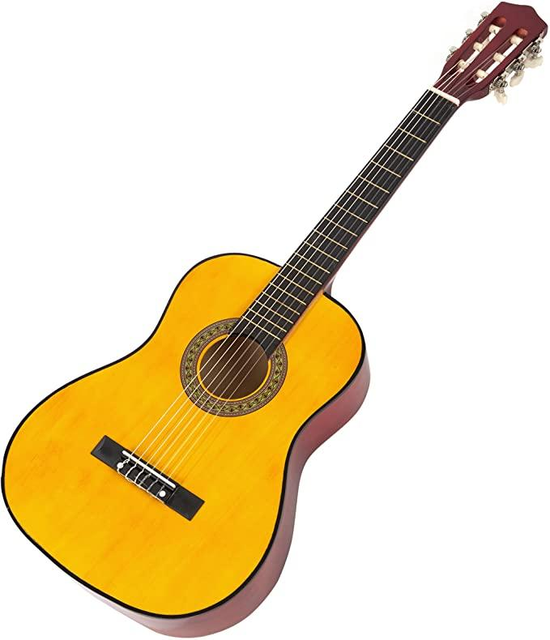

# Sam Gustafsson
Mobile Development | Data Science

## [Project 1: Tracker App (iOS): Project Overview](https://github.com/samgus/Tracker-App)
- Built an iOS app that allows the user to enter a tracking number and will return the details of the tracking item and then will be able to bookmark the tracking item to a list using CoreData.
- Utilized: Swift, Xcode

  

## [Project 2: Image Recognition App (Data Science): Project Overview](https://github.com/Ernulphus/capstone-Bsharp-AI)
- My capstone team and I built an AI app that identifies images of musical instruments. For the project, I programmed a web scraper using Selenium in order to collect over 40,000 images for our AI model to train.
- Utilized: Python, Selenium

   

## [Project 3: NYC Park Maintenance (Data Science): Project Overview](https://samgus.github.io)
- Coded a program that takes NYC open source data and finds the disparities for parks that are not receiving as much funding as other parks, depending on their NYC Zip Code.
- Utilized: Python

## [Project 4: Mock Twitter App (iOS): Project Overview](https://github.com/samgus/Twitter)
- Implemented Twitter features, such as liking, retweeting, posting, logging in/out, and connected the app to my actual Twitter account by calling the Twitter API.
- Utilized: Swift, Xcode

 
